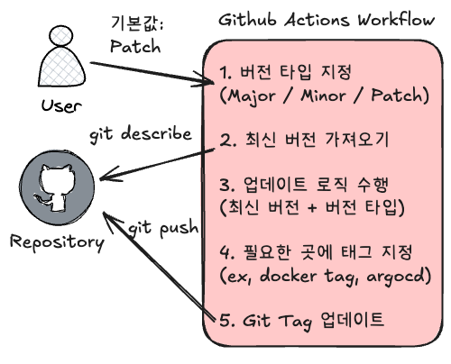

# Github Actions로 Auto Tagging 하기

프로젝트의 버전 관리는 매우 중요합니다. 해당 버전을 기준으로 배포하고 관리하면 운영상의 혼란을 줄일 수 있습니다.  
Github Actions를 사용해서 배포 시 자동으로 태그를 업데이트 하는 방법을 알아보겠습니다.

## 왜 Auto Tagging 이 필요한가?

프로젝트를 진행하면서 버전 관리를 수동으로 하다 보면 다음과 같은 문제들이 발생할 수 있습니다:

- 버전 태그 생성을 깜빡하는 경우
- 버전 규칙이 일관되지 않는 경우
- 여러 개발자가 각자 다른 방식으로 태그를 생성하는 경우

그리고 단순 Latest로 배포하는 것은 현재 버전을 파악하기 어렵고 ArgoCD와 같은 툴을 사용한다면 자동으로 배포되지 않습니다.

이러한 문제들을 해결하기 위해 Github Actions를 통한 자동화된 태깅 시스템을 구축할 수 있습니다.

## Semantic Versioning

소프트웨어 버전 번호를 체계적으로 관리하기 위한 방법으로, MAJOR.MINOR.PATCH 형식을 사용합니다.

#### 버전 규칙

각 숫자는 다음과 같은 의미를 가집니다:

- MAJOR: 이전 버전과 호환되지 않는 변경사항 (1.0.0 → 2.0.0)
- MINOR: 이전 버전과 호환되는 새로운 기능 추가 (1.0.0 → 1.1.0)
- PATCH: 이전 버전과 호환되는 버그 수정 (1.0.0 → 1.0.1)

#### 예시

현재 버전이 v1.2.3일 때:
- 버그 수정: v1.2.3 → v1.2.4 (PATCH)
- 새로운 기능: v1.2.3 → v1.3.0 (MINOR)
- 호환성이 깨지는 변경: v1.2.3 → v2.0.0 (MAJOR)

이러한 명확한 버전 관리를 통해 프로젝트의 변경사항을 쉽게 파악하고 관리할 수 있습니다.

## Github Actions 구현



사진에서 설명한 것처럼 Workflow는 아래와 같은 순서로 수행됩니다.

1. Workflow를 실행할 때 버전 타입을 사용자가 지정합니다. (기본값 Patch)

```yaml
name: Docker Build and Push

on:
  # 수동 실행을 위한 workflow_dispatch 추가
  workflow_dispatch:
    inputs:
      version_type:
        description: 'Version upgrade type (major/minor/patch)'
        required: true
        default: 'patch'
        type: choice
        options:
        - major
        - minor
        - patch
  # 자동으로 트리거된 경우 patch 버전 배포 (브랜치 전략에 따라 삭제 혹은 브랜치 변경)
  push:
    branches: [ main ]
```

2. 레포지토리로부터 태그를 가져옵니다. (기본값 v0.0.0)

```yaml
- name: Get latest tag
  id: get_latest_tag
  run: |
    latest_tag=$(git describe --tags --abbrev=0 2>/dev/null || echo "v0.0.0")
    echo "latest_tag=${latest_tag}" >> $GITHUB_ENV
```

3. 버전을 업데이트합니다.

시맨틱 버저닝(MAJOR.MINOR.PATCH) 규칙에 따라 버전을 업그레이드합니다. 그리고 이를 태그로 생성합니다. (git push)

```yaml
- name: Determine version bump
  id: semver
  run: |
    if [ "${{ github.event_name }}" = "workflow_dispatch" ]; then
      bump_type="${{ github.event.inputs.version_type }}"
    else
      bump_type="patch"
    fi
    
    # 현재 버전에서 새 버전 계산
    current_version=${latest_tag#v}
    IFS='.' read -r major minor patch <<< "$current_version"
    
    case $bump_type in
      major)
        new_version="$((major + 1)).0.0"
        ;;
      minor)
        new_version="${major}.$((minor + 1)).0"
        ;;
      patch)
        new_version="${major}.${minor}.$((patch + 1))"
        ;;
    esac
    
    echo "new_version=${new_version}" >> $GITHUB_OUTPUT
    echo "New version will be: ${new_version}"

- name: Create Git tag
  run: |
    git tag v${{ needs.version.outputs.new_version }}
    git push origin v${{ needs.version.outputs.new_version }}
```

4. 이를 필요한 곳에 정의하면 됩니다.

도커 빌드 시 태그를 지정하는 예시 (도커 로그인 중략)

```yaml
- name: Build and push Docker image
  uses: docker/build-push-action@v4
  with:
    context: .
    push: true
    tags: |
      ${{ secrets.DOCKERHUB_USERNAME }}/your-image:latest
      ${{ secrets.DOCKERHUB_USERNAME }}/your-image:v${{ needs.version.outputs.new_version }}
```

ArgoCD 배포를 위해 values.yaml 파일에 버전을 지정하는 예시\
(ArgoCD 애플리케이션 또한 동일 레포지토리에 있다고 가정)


```yaml

- name: Update Version in values.yaml
  run: |
    cd argocd-config/apps/your-app
    # yq를 사용하여 values.yaml 업데이트
    yq eval ".image.tag = \"v${{ needs.version.outputs.new_version }}\"" -i values.yaml

- name: Commit and Push Changes
  run: |
    cd argocd-config
    git config --global user.name 'github-actions[bot]'
    git config --global user.email 'github-actions[bot]@users.noreply.github.com'
    git add .
    git commit -m "chore: update image tag to v${{ needs.version.outputs.new_version }}"
    git push
```

5. Git Tag 업데이트

업데이트 된 태그를 Repository에 반영합니다. 

```yaml
- name: Create Git tag
  run: |
    git tag v${{ needs.version.outputs.new_version }}
    git push origin v${{ needs.version.outputs.new_version }}
``` 


## 마무리

이렇게 GitHub Actions를 통해 버전 관리를 자동화하면 다음과 같은 이점이 있습니다:

1. 일관된 버전 관리: Semantic Versioning 규칙에 따라 자동으로 버전이 관리됩니다.
2. 배포 자동화: 새로운 버전이 생성되면 자동으로 Docker 이미지가 빌드되고 ArgoCD를 통해 배포됩니다.
3. 실수 방지: 수동으로 버전을 관리할 때 발생할 수 있는 실수를 방지할 수 있습니다.
4. 시간 절약: 반복적인 버전 관리 작업을 자동화하여 개발자가 더 중요한 작업에 집중할 수 있습니다.

위 예시를 참고하여 프로젝트에 맞게 수정하여 사용하면 좋겠습니다~! 해당 코드는 https://github.com/Ssuwani/semantic-versioning 에 있습니다. 
